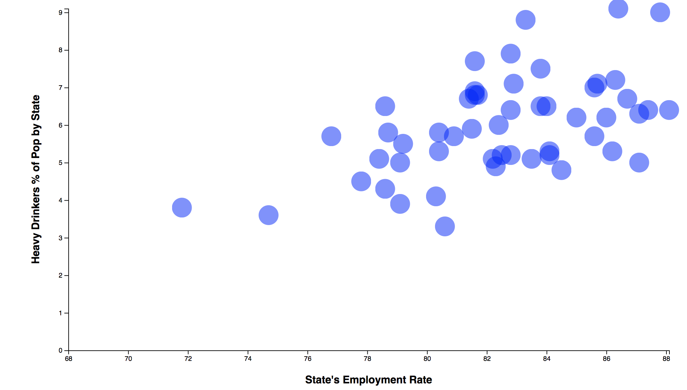

**Employment Rate by State vs. Heavy drinking Rates**

Data sources:

    - American Fact Finder, year 2014
        https://factfinder.census.gov/faces/nav/jsf/pages/index.xhtml

    - CDC's Behavioral Risk Factor Surveillance System (BRFSS), year 2014
        https://chronicdata.cdc.gov/Behavioral-Risk-Factors/BRFSS-2014-Overall/5ra3-ixqq

Notes:

American Fact Finder data by State shows employment rate, adults ages 24-44
BRFSS Data: Adults who have more than two drinks per day

- Employment rate vs. heavy drinking rate has a correlation of 0.52
- The higher the employment rate by state, the higher the percentage of the population that consumes more than 2 drinks per day
- Highest heavy drinking rate found in DC, along with the highest employment rate, followed by Vermont.

